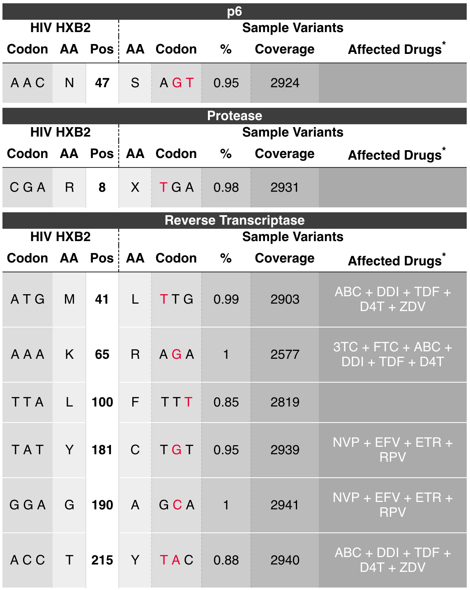
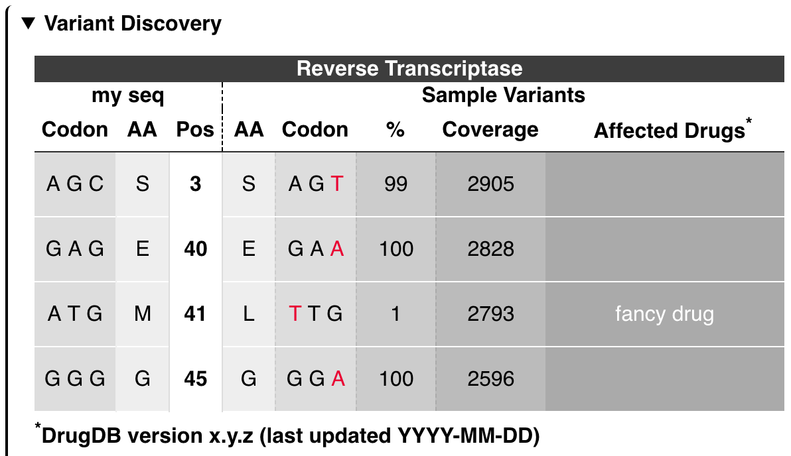
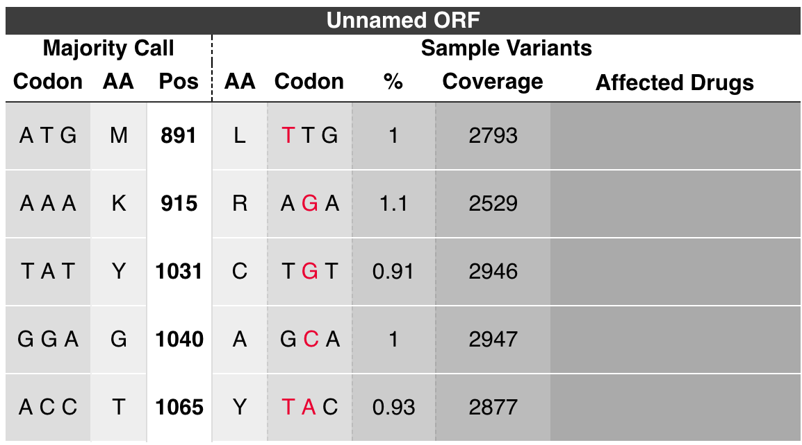
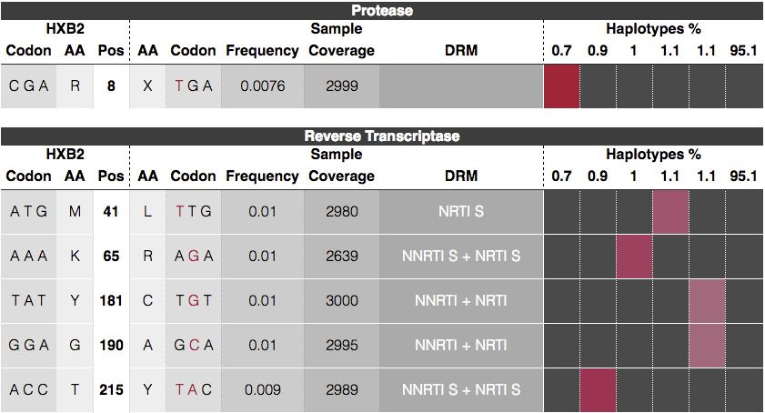

<h1 align="center">
    juliet - Minor Variant Caller
</h1>

<p align="center">
  
</p>

## Install
Install the minorseq suite and one of the binaries is called `juliet`.

## Input data
*Juliet* operates on aligned CCS records in the BAM format.
Reads should be created with [CCS2](../PBCCS.md).
BAM files have to PacBio-compliant, meaning, cigar `M` is forbidden.
*Juliet* currently does not demultiplex barcoded data,
provide one BAM per barcode.

## Scope
Current scope of *Juliet* is identification of codon-wise variants in coding
regions. Phasing of variants is work in progress.

## Output
*Juliet* provides a JSON and HTML file. The JSON file contains for each gene
the variant positions. Each variant position consists of the reference codon,
reference aminoacid, relative aminoacid position in the gene, the mutated codon
and aminoacid, the coverage, possible annotated drug resistance mutations, and
counts of the multiple-sequence alignment of the -3 to +3 context positions.

The HTML page is a 1:1 conversion of the JSON file and contains the identical
information, only human-readable.


## Target configuration
*Juliet* is a multi purpose minor variant caller with preinstalled configurations.
A target configuration may contain multiple coding regions and optional drug
resistance mutation positions.

### Predefined target config
Running on predefined organism:
```
$ juliet -c "<HIV>" data.align.bam -o patientZero
```



Currently available configs are: `<HIV>`

### Own target config
Create a JSON file. The root child genes contains a list of coding regions, with
begin and end, the name of the gene, and a list of drug resistent mutations
drms. Each DRM consists of its name and the positions it targets. The drms
field is optional. If provided, the referenceSequence is being used to call
mutations, otherwise it will be tested against the major codon. All indices are
with respect to the provided alignment space, 1-based.
Save following as hiv.json:
```
{
    "genes": [
        {
            "begin": 2550,
            "drms": [
                {
                    "name": "fancy drug",
                    "positions": [ 41 ]
                }
            ],
            "end": 2700,
            "name": "Reverse Transcriptase"
        }
    ],
    "referenceName": "my seq",
    "referenceSequence": "TGGAAGGGCT..."
}
```

Run with own target config:
```
$ juliet -c hiv.json data.align.bam -o patientZero
```




### No target config
If no target config has been specific, it is recommended to at least specify the
region of interest to mark the correct reading frame. The output will be labeled
with unknown as gene name:
```
$ juliet data.align.bam -o patientZero
```



## Phasing

*Juliet* default mode is amino-acid / codon calling. Using `--mode phasing`,
variant calls from identical haplotype being clustered and visualized in the
HTML output. The row-wise variant calls are "transposed" onto the per column
haplotypes. For each variant, the haplotype shows a colored box, wild type is
represented by plain dark gray. A color gradiant helps to distinguish between
columns.



The JSON variant positions has an additional `haplotype_hit` bool array
with the length equal to the number of haplotypes. Each entry indicates if that
variant is present in the haplotype. A `haplotype` block under the root of the
JSON file contains counts and read names. The order of those haplotypes matches
the order of all `haplotype_hit` arrays.

# FAQ

### Can I use overlapping regions?
Yes! Each gene is treated separately. Overlapping region, even with different
reading frames are possible.

### Can I call a smaller window from a target config?
Use `--region` to specify the begin-end window to subset the target config.