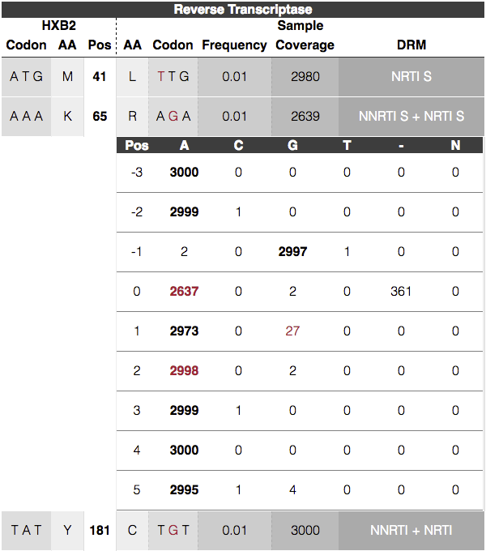
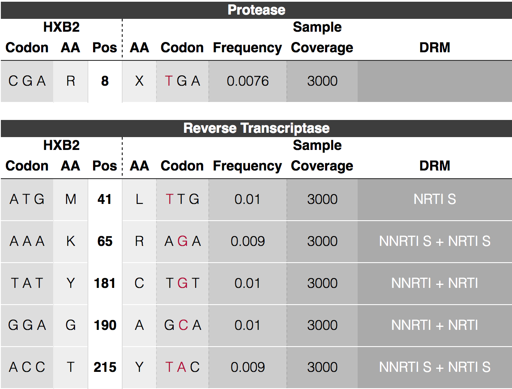
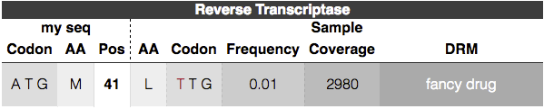
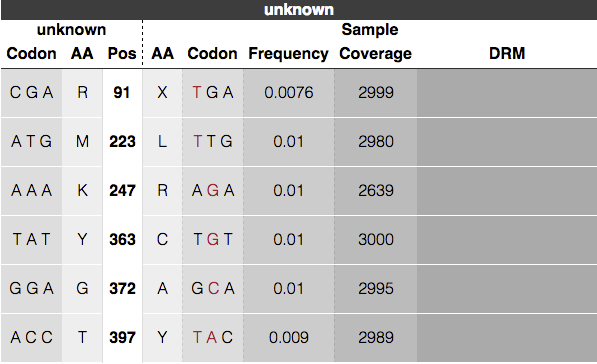

<h1 align="center">
    juliet - Minor Variant Caller
</h1>

<p align="center">
  
</p>

## TOC
* [Scope](#scope)
* [Performance](#performance)
* [Model](#model)
* [Install](#install)
* [Input data](#input-data)
* [Output](#output)
* [Target configuration](#target-configuration)
* [Phasing](#phasing)
* [FAQ](#faq)

## Scope
Current scope of *Juliet* is identification of codon-wise variants in coding
regions. *Juliet* performs a reference-guided, de-novo variant discovery
and annotates known drug-resistance mutations. There is no technical
limitation with respect to the target organism or gene.
A first version of variant phasing is available.
Insertion and deletion variants are currently being ignored;
support will be added in a future version.

## Performance

Both, theoretical and empirical, performance estimates agree with the following
statement:

At a coverage of 6000 CCS reads with a predicted accuracy (RQ) of >=0.99,
the false positive and false negative rates are below 1% and
0.001% (10<sup>-5</sup>), respectively.

## Model

The underlying model is a statistical test, comparing the number of observed
mutated codons to the number of expected mutations at a given position.
The particular test is a Bonferroni-corrected Fisher's Exact test.

## Install

Install the minorseq suite using bioconda, more info [here](../README.md).
One of those binary executables is called `juliet`.

## Input data
*Juliet* operates on CCS records in the BAM format.
Reads should be created with [CCS2](https://github.com/PacificBiosciences/unanimity/blob/master/doc/PBCCS.md)
using the `--richQVs` option.
BAM files have to PacBio-compliant, meaning, cigar `M` is forbidden.
*Juliet* currently does not demultiplex barcoded data;
provide one BAM per barcode.
Input CCS reads should have a minimal predicted accuracy of 0.99,
filtering instruction [available here](JULIETFLOW.md#filtering).
Reads that are not primary or supplementary alignments, get ignored.

## Output
*Juliet* provides a JSON and/or HTML file:
```
$ juliet data.align.bam patientZero.html
$ juliet data.align.bam patientZero.json
$ juliet data.align.bam patientZero.html patientZero.json
```

The HTML page is a 1:1 conversion of the JSON file and contains the identical
information, but more human-readable.

The HTML file contains four sections:

 

### Section 1. Input data

This section of the HTML output summarizes the data provided, the
exact call for *juliet*, and version of *juliet* for traceability
purposes

 

### Section 2. Target Config

Details of the provided target config are summarized for traceability.
The config version, reference name and length, and annotated genes.
Each gene with its name in bold, followed by the reference start, end positions,
and possibly known drug resistance mutations.

 

### Section 3. Variant Discovery

For each gene open reading frame, there is one overview table.
Each row represents a variant position.
Each variant position consists of the reference codon, reference amino acid,
relative amino acid position in the gene, the mutated codon, the mutated amino
acid, the coverage, and possible annotated drug resistance mutations.
Clicking the row will show counts of the multiple-sequence alignment counts of
the -3 to +3 context positions.



### Section 4. Drug Summaries
This view summarizes the variants grouped by annotated drug mutations:


## Target configuration

*Juliet* is a multi-purpose minor variant caller that uses simple
target configuration files to define different genes of interest such
as HIV open reading frames to BCR-ABL kinase regions. There are preinstalled
configurations to ease batch applications and allow immediate reproducibility.
A target configuration may contain multiple coding regions within a gene
sequence and optional drug resistance mutation positions.

### Predefined target config
Running on predefined genome such as HIV:
```
$ juliet --config "HIV" data.align.bam patientZero.html
```



Currently available configs are: `HIV`, `ABL1`

### Customized target configuration
To define your own target configuration, create a JSON file. The root child
genes contains a list of coding regions, with
begin and end, the name of the gene, and a list of drug resistent mutations
drms. Each DRM consists of its name and the positions it targets. The "drms"
field is optional. If provided, the referenceSequence is being used to call
mutations, otherwise it will be tested against the major codon. All indices are
with respect to the provided alignment space, 1-based, begin-inclusive and
end-exclusive `[)`.
Here is a "hiv.json" target configuration file:
```
{
    "genes": [
        {
            "begin": 2550,
            "drms": [
                {
                    "name": "fancy drug",
                    "positions": [ "M41L" ]
                }
            ],
            "end": 2700,
            "name": "Reverse Transcriptase"
        }
    ],
    "referenceName": "my seq",
    "referenceSequence": "TGGAAGGGCT...",
    "version": "Free text to version your config files",
    "databaseVersion": "DrugDB version x.y.z (last updated YYYY-MM-DD)"
}
```

Run with customized target config using the `--config` option:
```
$ juliet --config hiv.json data.align.bam patientZero.html
```



Valid formats for `drms/positions`

    "103"     <- only the reference position
    "M130"    <- reference amino acid and ref pos
    "M103L"   <- ref aa, ref pos, mutated aa
    "M103LKA" <- ref aa, ref pos, list of possible mutated aas
    "103L"    <- ref pos and mut aa
    "103LG"   <- ref pos and list mut aas

Missing amino acids are processed as wildcard `*`

Example

    { "name": "ATV/r", "positions": [ "V32I", "L33", "46IL", "I54VTALM", "V82ATFS", "84" ] }

### No target config
If no target config has been specific, it is recommended to at least specify the
region of interest to mark the correct reading frame so amino acids are
correctly translated. The output will be labeled with `unknown` as gene name:
```
$ juliet data.align.bam patientZero.html
```



## Phasing

*Juliet's* default mode is to call amino-acid / codon variants independently.
Using `--mode-phasing`, variant calls from distinct haplotypes are clustered
and visualized in the HTML output.
The row-wise variant calls are "transposed" onto per column haplotypes.
Each haplotype has an ID: `[A-Z]{1}[a-z]?`.
For each variant, colored boxes in this row mark haplotypes that contain this
variant.
Colored boxes per haplotype / column indicate variants that co-occur.
Wild type, no variant, is represented by plain dark gray.
A color palette helps to distinguish between columns.


The JSON variant positions has an additional `haplotype_hit` bool array
with the length equal to the number of haplotypes. Each entry indicates if that
variant is present in the haplotype. A `haplotype` block under the root of the
JSON file contains counts and read names. The order of those haplotypes matches
the order of all `haplotype_hit` arrays.

# FAQ

### Why PacBio CCS for minor variants?
PacBio systems have shown to have no systematic errors and allow for
generation of high-quality CCS reads. *Juliet* can reliably call minor variants
and phase co-occurring mutation patterns without employing complex and unreliable
computational models.

### Why is my chemistry not supported?
Official support is for Sequel chemistries. If you use Sequel and your chemistry
is not supported, your *juliet* installation might be outdated.
If your chemistry is not officially supported, e.g. RSII, permissive mode is
active. In this case, higher type I and II errors might be observed.

### My coverage is much lower than 6000x
There is a trade-off between coverage and FP/FN rates.
The following table shows the minimal and advised coverages for different
expected minor frequencies. For the minimal coverage, FP/FN rates may increase;
for reliable coverages, the [above mentioned](#performance) estimates hold:

|Percentage|Minimal|Reliable|
|-|-|-|
|1%|2500X|6000X|
|5%|500X|1200X|
|10%|250X|600X|

### Can I go lower than 1%?
Yes, but we haven't tested this yet. In theory, at a coverage of ~25000X,
a 0.1% minor should be identified. Be aware at that coverage, RT and PCR errors
will be **highly** abundant. Make sure to run as few PCR rounds as necessary.

### Why do I see so many false positive calls?
Maybe you ran a control/titration experiment to test *juliet's* performance and
see many false positive calls. All of those are likely to be artifacts of your
sample preparation, due to RT and PCR errors. Try to limit the number of PCR
rounds and use high-fidelity enzymes.
If that does not help, sample your coverage down to the advised reliable
coverage. We tested clean samples, amplified in plasmids, and at 25000x there
is not a single false positive call.

### Is the a minimum threshold for reported haplotypes?
Yes, we need to see at least 10 reads from the same haplotype to report it.

### Why are there N bases in the overview?
We filter bases based on the individual QV tracks to remove possible
heteroduplexes. A filtered base shows up as N and does not count towards the
coverage.

### Can I use overlapping regions?
Yes! Each gene is treated separately. Overlapping region, even with different
reading frames are possible. This is important for densely encoded genomes like
HIV.

### Can I use non-coding regions?
Yes, but any codon that does not translate to an amino acid is being ignored.
If you want explicit support, please contact us.

### Can I call a smaller window from a target config?
Use `--region` to specify the begin-end window to subset the target config.

### What if I don't use --richQVs generating CCS reads?
Without the `--richQVs` information, the number of false positive calls might
be higher, as *juliet* is missing information to filter actual heteroduplexes in
the sample provided.

### Why do some variants have no associated haploypes?
Scenarios as in the following figure may happen. In this case, all reads
associated to that variant contain a frame-shift deletion and
thus won't be reported.


### Why are there no haplotype columns, even though I activated phasing?
In this case, each and every read has at least one deletion in one of the
identified variant codon positions; thus reads cannot be assigned naïvely.
An upcoming version might fix this.

### What about hyper-variable regions like HIV envelope?
We currently do not support hyper-variable regions and the above mentioned
performance characterics do not hold. Feel free to test it on your own.

### What database did you use for the HIV drug-resistance mutations?
We copied the major variants from [hivdb.stanford.edu](https://hivdb.stanford.edu).

### Are you going to maintain the drug-resistance mutations in the target configs?
No. Juliet is a general purpose minor variant caller.
The integrated target configs are meant for a quick start.
It is the user's responsibility to ensure that the used target configs are
correct and up-to-date.

### I need a config for my target organism / gene.
Please read [Customized Target Configuration](JULIET.md#customized-target-configuration).

### Can you give a target config example other than HIV?
For BCR-ABL, using the ABL1 gene with the
[following reference NM_005157.5](https://www.ncbi.nlm.nih.gov/nuccore/NM_005157.5),
a typical target config could look like this:
```
{
    "genes": [
        {
            "name": "ABL1",
            "begin": 193,
            "end": 3585,
            "drms": [
                {
                    "name": "imatinib",
                    "positions": [ "T315AI","Y253H","E255KV","V299L","F317AICLV","F359CIV" ]
                },
                {
                    "name": "dasatinib",
                    "positions": [ "T315AI","V299L","F317AICLV" ]
                },
                {
                    "name": "nilotinib",
                    "positions": [ "T315AI","Y253H","E255KV","F359CIV" ]
                },
                {
                    "name": "bosutinib",
                    "positions": [ "T315AI" ]
                }
            ]
        }
    ],
    "referenceName": "NM_005157.5",
    "referenceSequence": "TTAACAGGCGCGTCCC..."
}
```

### Can I filter for a minimal percentage?
Yes, with `--min-perc`. For example, `--min-perc 1` will only show variant calls
with an observed abundance of more than 1%.

### Can I skip major variant calls, while using a target config?
Maybe your output looks like a rainbow with most of the calls being the major
call above 90%:


The option `--max-perc` skips variants above a given threshold.
For example, `--max-perc 90` will only show variant calls with an observed
abundance of less than 90%. This might also help to phase minor variants.

Another example, where major calls dilute phased minor variant haplotypes below
the threshold.


**BEFORE (partial screenshot):**


**AFTER:**


### Can I filter for drug-resistance mutations?
Yes, with `--drm-only` only known variants from the target config are being called.

### What's up with the haplotype tooltips?
There are two types of tooltips in the haplotype part of the table.
The first tooltip is for the "Haplotypes %" and shows the number of reads that
count towards (a) actually reported haplotypes, (b) haplotypes that have
less than 10 reads and are not being reported,
and (c) haplotypes that are not suitable for phasing.
Those first three categories are mutually exclusive and their sum is the
total number of reads going into juliet.
For the (c), the three different marginals provide insights into the sample
quality; as they are marginals, they are not exclusive and can overlap.
The following screenshot shows a sample with bad PCR conditions:


The second type of tooltip is for each haplotype percentage and shows the
number of reads contributing to this haplotype:

