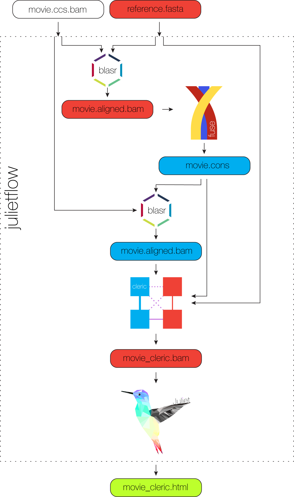

<h1 align="center">
    julietflow - Minor variant pipeline
</h1>

## Install
Install the minorseq suite using bioconda, more info [here](../README.md).
The script is called `julietflow`.

## Input data
*Julietflow* operates on unaligned ccs reads in the BAM format and a close
reference sequence.
BAM files have to PacBio-compliant, meaning, cigar `M` is forbidden, and input
reads have to be greater RQ 0.99.

## Scope
Current scope of *julietflow* is automatization of the re-align workflow for
minor variant calling.

## Output
*Julietflow* provides the html output of juliet in the current directory and the
intermediate files in `tmp/` if `-k` is set.

## Filtering
*Juliet* relies on high-quality input data, please filter your ccs data and
downsample it to 6000x:
```
INPUT=yourdata.ccs.bam
OUTPUT=yourdata.filtered.ccs.bam
samtools view -H ${INPUT} > ${INPUT}.tmp
samtools view ${INPUT} | grep "rq:f:0.99\|rq:f:1" >> ${INPUT}.tmp
samtools view -bS ${INPUT}.tmp > ${OUTPUT}
```

## Example
```
julietflow -i m530526.ccs.bam -r hxb2.fasta
```

Output: `m530526_cleric.html`

## Dependencies
All dependencies are automatically installed.

## Help
Please use `--help` for more options of *julietflow*.

## Workflow
<p align="center">
  
</p>